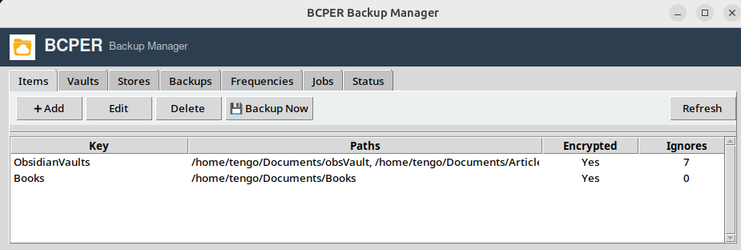
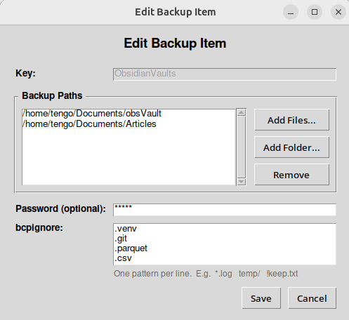
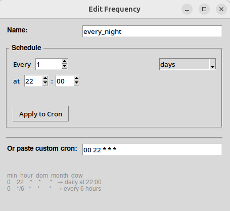
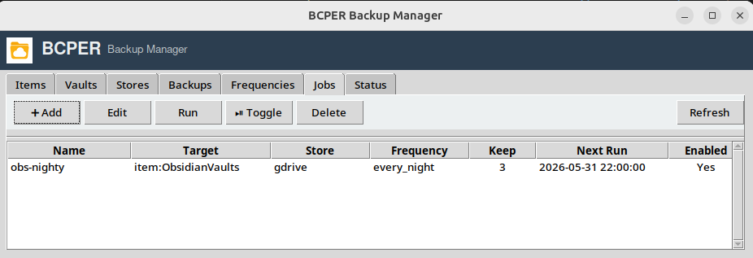
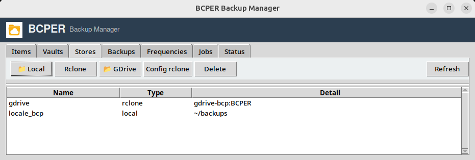

# BCPER


Lightweight desktop backup manager with a background daemon, cron-based scheduling, and a Tkinter GUI.

## Features

### Entities

- **Items** — Named backup targets (files or directories). Each item has its own paths, optional encryption password, and `bcpignore` patterns.
- **Vaults** — Named collections of items. Vaults can have their own password and ignore patterns. Item-level settings override vault-level settings.
- **Stores** — Where backups live. Supports **local directories** or any **rclone remote** (Google Drive, S3, SFTP, etc.). Rclone is auto-downloaded if not in `PATH`.
- **Frequencies** — Reusable cron-based schedules. Use the friendly builder ("Every 2 days at 22:00", "Weekly on Monday at 08:00") or paste a raw 5-field cron expression. Intervals shorter than 5 minutes are rejected to prevent accidents.
- **Jobs** — Link a target (item or vault), a store, and a frequency. Jobs can be enabled/disabled, run manually on demand, and have configurable retention (`keep_last`).
- **Backups (Runs)** — Every execution gets a UUID and is tracked in a local SQLite database. Browse, multiselect-restore, and multiselect-delete runs from any store.

### Scheduling & Catch-Up

- **Cron scheduling** — Powered by `croniter`. Standard 5-field cron plus a "once" option.
- **Missed-job catch-up** — If your machine was off when a job was scheduled, the daemon runs missed jobs sequentially on the next startup.
- **Retention** — After each successful job run, old backups beyond `keep_last` are automatically pruned from both the store and the database.

### Backup Engine

- **Archiving** — Tar + gzip compression.
- **Encryption** — AES-256-GCM with PBKDF2 password derivation (optional per item/vault).
- **Integrity** — SHA-256 checksums stored alongside archives. Warnings on hash mismatch during restore.
- **Ignore patterns** — Gitignore-style filters (`*`, `**`, `!`, directory-only `/`). Item patterns override vault patterns.
- **Progress tracking** — Live step text during backup, restore, delete, and manual runs.

### Desktop GUI

- **Tabs**: Items, Vaults, Stores, Backups, Frequencies, Jobs, Status.
- **Multiselect** in Backups tab — Ctrl/Cmd+click or Shift+click to select multiple runs, then restore or delete them in one operation.
- **Running jobs banner** — Blue header banner appears when backups are active, showing job names.
- **Daemon status banner** — Red header banner appears when the daemon is offline, with a one-click **Start Daemon** button.
- **Restart Daemon** button in the Status tab for quick daemon recycling.
- **Shell integration** — One-click setup of `bcper`, `bcperd`, and `bcper-cli` aliases in `.bashrc` / `.zshrc`.

### CLI

A full command-line interface is available via `bcper-cli` (or `python -m bcper.cli`):

```bash
bcper-cli item list
bcper-cli item add my-item /path/to/data --ignore "*.log"
bcper-cli vault add my-vault --items my-item
bcper-cli store add local-store --type local --path ~/backups
bcper-cli frequency add daily-22 --name "Daily at 22:00" --cron "0 22 * * *"
bcper-cli job add --name nightly --target-type vault --target-name my-vault --store-name local-store --frequency-id daily-22
bcper-cli job list
```

## Install

Uses [uv](https://docs.astral.sh/uv/):

```bash
uv sync
```

On Debian/Ubuntu you may need Tkinter for the GUI:

```bash
sudo apt-get install python3-tk
```

## Build Debian package

```bash
./build-deb.sh
sudo dpkg -i bcper_0.1.0_all.deb
sudo apt-get install -f   # if dependencies are missing
```

## Usage

### Start the daemon

```bash
python3 -m bcperd
# or
uv run python -m bcperd
```

The daemon writes its PID to `~/.config/bcper/daemon.pid` and listens on a Unix socket at `~/.config/bcper/daemon.sock`. It refuses to start if another instance is already running.

### Open the GUI

```bash
python3 -m bcper
# or
uv run python -m bcper
```

The GUI checks daemon status every 3 seconds and shows a banner when it is offline.

### Quick CLI smoke test

```bash
python3 -c "
import tempfile, os
from bcper_core.config import Config
from bcper_core.models import BCItem
from bcper_core.engine import TarGzBackupEngine
from bcper_core.storage import LocalStore

with tempfile.TemporaryDirectory() as td:
    src = os.path.join(td, 'src')
    dst = os.path.join(td, 'backups')
    os.makedirs(src)
    with open(os.path.join(src, 'hello.txt'), 'w') as f:
        f.write('world')
    item = BCItem(key='test', paths=[src])
    store = LocalStore(dst)
    engine = TarGzBackupEngine()
    result = engine.backup(item, store)
    print('Backup:', result)
    restore = engine.restore(result['archive'], store, target_dir=os.path.join(td, 'restore'))
    print('Restore:', restore)
"
```

## Configuration Tabs

### Items
Create backup items (files and directories). Each item can have:
- Multiple source paths
- Optional encryption password
- `bcpignore` patterns (one per line)

### Vaults
Group multiple items into vaults. Vaults can also have their own password and ignore patterns. Item-level settings override vault-level settings.

### Stores
Configure where backups are saved:
- **Local** — any local directory
- **Rclone** — any rclone remote (Google Drive, S3, SFTP, etc.)

Rclone is auto-downloaded to `~/.local/share/bcper/rclone` if not found in `PATH`. You can open the rclone config directly from the Stores tab.

### Frequencies
Define reusable schedules. The friendly builder supports:
- Every N **hours**
- Every N **days** at HH:MM
- Every **week** on a weekday at HH:MM
- Every N **months** on a day at HH:MM

Or paste any standard 5-field cron expression. Intervals under 5 minutes are rejected.

### Jobs
Create backup jobs that link a target (item or vault), a store, and a frequency. Each job has:
- **Enabled** toggle
- **Keep last** — number of backups to retain (default 3)
- Manual **Run** button for on-demand execution

Double-click a job to edit it. Excess backups are automatically deleted after each successful run.

### Backups
Browse runs in a selected store. The table shows:
- Run ID (short)
- Job name
- Target
- Started time
- Status (success / failed / running)
- Encrypted (Yes / No)

**Multiselect** with Ctrl/Cmd+click or Shift+click, then use **Restore** or **Delete**. Restoring asks for a single target directory. Deleting confirms the count and short IDs before proceeding.

### Status
- View daemon status and recent log output
- **Start Daemon** / **Restart Daemon**
- **Shell Integration** — one-click alias setup

## Google Drive Setup

BCPER uses rclone for Google Drive and other cloud storage.

```bash
# 1. Install rclone (or let BCPER auto-download it)
sudo apt-get install rclone   # or download from https://rclone.org/

# 2. Configure Google Drive
rclone config
#   n) New remote
#   name: gdrive
#   type: drive
#   follow the OAuth flow in your browser

# 3. Verify
rclone lsd gdrive:
```

Then open the GUI, go to the **Stores** tab, and click **Add RClone Store**.

## Configuration & Data

Stored at `~/.config/bcper/`:

| File | Purpose |
|------|---------|
| `config.json` | Items, vaults, jobs, frequencies, stores |
| `bcper.db` | SQLite database tracking every backup run |
| `daemon.log` | Daemon log output |
| `gui.log` | GUI log output |
| `daemon.pid` | Active daemon PID |
| `daemon.sock` | Unix socket for GUI ↔ daemon IPC |

## Architecture

```
┌─────────────┐     Unix socket IPC      ┌─────────────┐
│   GUI       │  ◄────────────────────►  │   Daemon    │
│  (Tkinter)  │   newline-delimited JSON │  (asyncio   │
└─────────────┘                          │   + threads)│
                                         └──────┬──────┘
                                                │
                       ┌────────────────────────┼────────────────────────┐
                       │                        │                        │
                  ┌────┴────┐            ┌─────┴─────┐           ┌──────┴──────┐
                  │ Config  │            │  SQLite   │           │  Scheduler  │
                  │ (JSON)  │            │  (runs)   │           │  (croniter) │
                  └─────────┘            └───────────┘           └─────────────┘
```

- **Blocking I/O** (backup engine, rclone, SQLite) runs inside a `ThreadPoolExecutor`.
- **Catch-up** runs missed jobs sequentially on daemon startup before the scheduler loop begins.
- **Orphan cleanup** removes jobs whose targets, stores, or frequencies no longer exist.

## Logs

- Daemon: `~/.config/bcper/daemon.log`
- GUI: `~/.config/bcper/gui.log`

## Error Handling

Expected errors (wrong password, missing target, rclone misconfiguration, daemon offline, etc.) are reported as clean user-facing messages without tracebacks. Unexpected bugs are logged with full tracebacks for debugging.

## Screens: 










