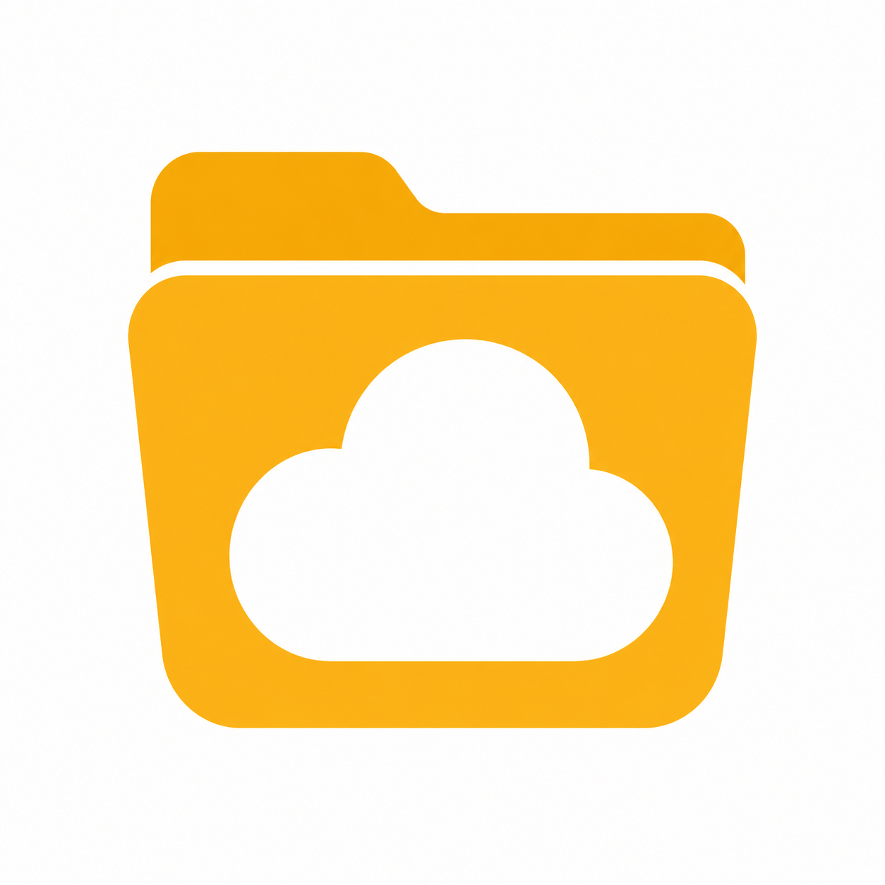

# BCPER



Lightweight desktop backup manager with a background daemon worker.

## Features

- **BCItem** - named backup item with paths, optional password, and `bcpignore` patterns.
- **BCVault** - named backup set composed of BCItems, with its own password and ignores.
- **bcpignore** - gitignore-style filters; item patterns override vault patterns.
- **Scheduling** - hourly or daily frequencies with configurable interval and optional time of day.
- **Retention** - each job can keep a configurable number of recent backups; older ones are auto-deleted after successful runs.
- **Encryption** - AES-256-GCM with PBKDF2 password derivation.
- **Integrity** - SHA-256 checksums stored alongside archives; warnings on mismatch.
- **Storage** - local directory or remote via rclone (auto-downloaded if not in PATH).
- **Desktop GUI** - Tkinter-based configuration and control panel with loading indicators for remote operations.
- **Daemon** - background scheduler and worker process with Unix-socket IPC.
- **Progress tracking** - live step text during backup, restore, delete, and manual job runs.
- **Shell integration** - one-click setup of aliases in `.bashrc` or `.zshrc`.

## Install from source

Uses [uv](https://docs.astral.sh/uv/).

```bash
uv sync
```

On Debian/Ubuntu you may need Tkinter for the GUI:

```bash
sudo apt-get install python3-tk
```

## Build Debian package

A `build-deb.sh` script is included to produce a `.deb` package without extra tooling:

```bash
./build-deb.sh
```

This creates `bcper_0.1.0_all.deb`, which can be installed with:

```bash
sudo dpkg -i bcper_0.1.0_all.deb
sudo apt-get install -f   # if dependencies are missing
```

## Usage

### Start the daemon

```bash
python3 -m bcperd
```

Or from source with uv:

```bash
uv run python -m bcperd
```

The daemon writes its PID to `~/.config/bcper/daemon.pid` and listens on a Unix socket at `~/.config/bcper/daemon.sock`. It refuses to start if another daemon is already running.

### Open the GUI

```bash
python3 -m bcper
```

Or from source with uv:

```bash
uv run python -m bcper
```

The GUI checks daemon status every 3 seconds. If the daemon is offline, a banner appears with a "Start Daemon" button.

### Quick CLI smoke test

```bash
python3 -c "
import tempfile, os, time
from bcper_core.config import Config
from bcper_core.models import BCItem
from bcper_core.engine import BackupEngine
from bcper_core.storage import LocalStore

with tempfile.TemporaryDirectory() as td:
    src = os.path.join(td, 'src')
    dst = os.path.join(td, 'backups')
    os.makedirs(src)
    with open(os.path.join(src, 'hello.txt'), 'w') as f:
        f.write('world')
    item = BCItem(key='test', paths=[src])
    store = LocalStore(dst)
    engine = BackupEngine()
    result = engine.backup_item(item, store)
    print('Backup:', result)
    restore = engine.restore(result['archive'], store, target_dir=os.path.join(td, 'restore'))
    print('Restore:', restore)
"
```

## Configuration Tabs

### Items
Create and manage backup items (files and directories to back up). Each item can have its own password, description, and ignore patterns.

### Vaults
Group multiple items into vaults. Vaults can also have their own password and ignore patterns. Item-level settings override vault-level settings.

### Stores
Configure where backups are saved:
- **Local** - any local directory
- **RClone** - any rclone remote (Google Drive, S3, SFTP, etc.)

Rclone is auto-downloaded to `~/.local/share/bcper/rclone` if not found in PATH. You can open the rclone config directly from the Stores tab.

### Frequencies
Define how often jobs run. Supported periods:
- **Hourly** - run every N hours
- **Daily** - run every N days, optionally at a specific time (HH:MM)

Double-click a frequency to edit it.

### Jobs
Create backup jobs that link a target (item or vault), a store, and a frequency. Each job has:
- **Enabled** toggle
- **Keep last** - number of backups to retain (default 3)
- Manual **Run** button for on-demand execution

Double-click a job to edit it. Excess backups are automatically deleted after each successful run.

### Backups
Browse archives in a selected store. Remote stores show a loading indicator while the list is being fetched. Double-click an archive to restore it.

### Status
View daemon status, recent log output, start the daemon, or add shell integration aliases to `.bashrc` / `.zshrc`.

## Shell Integration

Open the GUI and go to the **Status** tab, then click **Shell Integration**. Choose `.bashrc` and/or `.zshrc` and click **Apply**. This adds:

```bash
export PYTHONPATH="/path/to/bcper:$PYTHONPATH"
alias bcper='python3 -m bcper'
alias bcperd='python3 -m bcperd'
alias bcper-cli='python3 -m bcper.cli'
```

The dialog detects existing entries and skips duplicates.

## Google Drive Setup

BCPER uses rclone for Google Drive and other cloud storage.

```bash
# 1. Install rclone (or let BCPER auto-download it)
sudo apt-get install rclone   # or download from https://rclone.org/

# 2. Configure Google Drive
rclone config
#   n) New remote
#   name: gdrive
#   type: drive
#   follow the OAuth flow in your browser

# 3. Verify
rclone lsd gdrive:
```

Then open the GUI, go to the **Stores** tab, and click **Add RClone Store**.

## Configuration File

Stored at `~/.config/bcper/config.json`:

- `items` - BCItem dictionary
- `vaults` - BCVault dictionary
- `jobs` - scheduled backup jobs with frequency references and keep_last
- `stores` - backup store configurations
- `frequencies` - reusable schedule definitions

## Logs

- Daemon: `~/.config/bcper/daemon.log`
- GUI: `~/.config/bcper/gui.log`

## Error Handling

Expected errors (wrong password, missing files, daemon not running, etc.) are reported as clean messages without tracebacks. Unexpected bugs are logged with full tracebacks for debugging.

## IPC

The daemon listens on a Unix domain socket at `~/.config/bcper/daemon.sock`. The GUI communicates over this socket using newline-delimited JSON messages. Each client call uses its own socket connection so slow remote operations do not freeze the UI.
